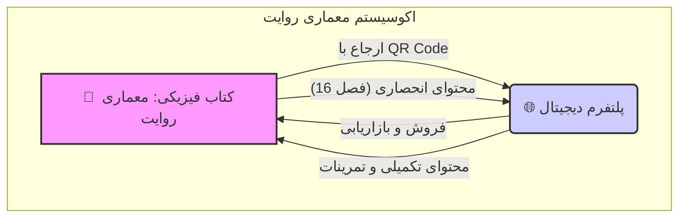
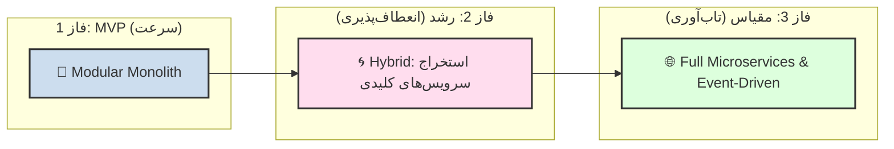
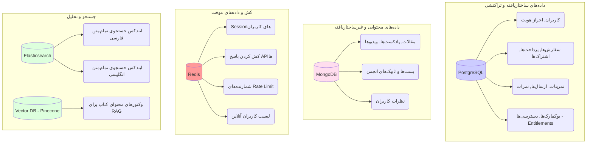
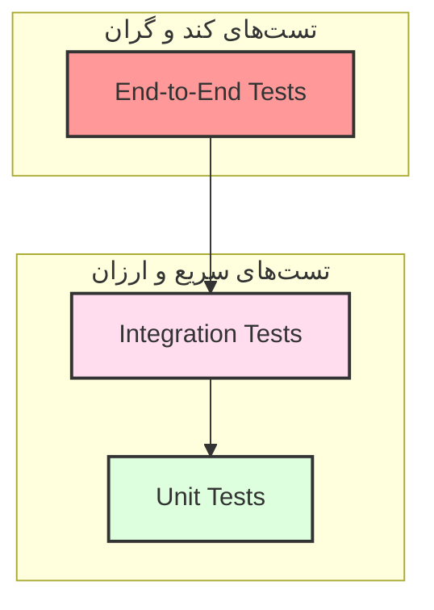

# 📜 بریف جامع پروژه "معماری روایت" (نسخه 1.0)

**سند شماره:** `NAR-BRIEF-V1.0`  
**تاریخ:** `2024-11-18`  
**تهیه‌کننده:** `Chief Technology Strategist`  
**وضعیت:** `نهایی - آماده برای تیم توسعه و محصول`

---

## 📄 **بخش 1 از 8: چشم‌انداز، مأموریت، و استراتژی محصول**

این سند، یک نمای کلی، استراتژیک، و فنی از پروژه "معماری روایت" ارائه می‌دهد. هدف آن، ایجاد یک درک مشترک و عمیق برای تمام ذی‌نفعان پروژه، از جمله تیم‌های توسعه، محصول، و کسب‌وکار است.

---

### **1.1. مقدمه: چرا "معماری روایت"؟**

در دنیایی که هوش مصنوعی در حال بازتعریف فرآیندهای خلاقانه است، "معماری روایت" با یک مأموریت دوگانه متولد شده است:
1.  **صیانت از هنر داستان‌گویی:** ارائه یک منبع عمیق، ساختاریافته و معتبر برای یادگیری اصول بنیادین روایت.
2.  **توانمندسازی نویسندگان مدرن:** فراهم کردن ابزارهایی هوشمند برای ارتقاء مهارت، دریافت بازخورد، و تعامل با جامعه‌ای از همفکران.

این پروژه صرفاً یک پلتفرم آموزشی نیست؛ بلکه یک **اکوسیستم دیجیتال** است که کتاب، جامعه، و تکنولوژی را در هم می‌آمیزد تا به مرجع اصلی نویسندگان در سراسر جهان تبدیل شود.

### **1.2. چشم‌انداز و مأموریت**

*   **چشم‌انداز (Vision):** "تبدیل شدن به معتبرترین و الهام‌بخش‌ترین اکوسیستم دیجیتال برای یادگیری، خلق، و تعالی در هنر روایت‌شناسی در سطح جهانی."
*   **مأموریت (Mission):** "ما با ترکیب آموزش ساختارمند، ابزارهای هوشمند، و یک جامعه پویا، به نویسندگان کمک می‌کنیم تا داستان‌های بهتری خلق کنند."

### **1.3. استراتژی محصول: مدل اکوسیستم هیبریدی**

محصول ما از دو جزء اصلی و در هم تنیده تشکیل شده است که هر یک دیگری را تقویت می‌کند:

<br>



<br>

| جزء محصول | نقش استراتژیک |
| :--- | :--- |
| **📖 کتاب فیزیکی** | **نقطه ورود و اعتبار:** به‌عنوان یک منبع مرجع، معتبر و فیزیکی، اعتماد و علاقه اولیه را ایجاد می‌کند. |
| **🌐 پلتفرم دیجیتال**| **موتور رشد و تعامل:** با ارائه محتوای پویا، ابزارهای تعاملی، و جامعه، کاربران را حفظ کرده و مدل درآمدی را پایدار می‌سازد. |

این هم‌افزایی به ما اجازه می‌دهد تا هم در دنیای آفلاین (از طریق کتاب) و هم در دنیای آنلاین (از طریق پلتفرم) حضور داشته باشیم و یک **تجربه کاربری یکپارچه (Omnichannel)** خلق کنیم.

### **1.4. مدل تجاری: Freemium + فروش مستقیم**

مدل درآمدی ما چندلایه و طراحی شده برای رشد پایدار است:

| مدل | شرح | هدف اصلی |
| :--- | :--- | :--- |
| **فروش مستقیم** | فروش کتاب فیزیکی و دوره‌های آموزشی ویژه. | ایجاد درآمد اولیه و جذب کاربران متعهد. |
| **Freemium** | ارائه رایگان بخش بزرگی از محتوای پلتفرم (مقالات، انجمن) برای جذب حداکثری کاربران. | ساخت جامعه و ایجاد قیف فروش (Sales Funnel). |
| **اشتراک (Subscription)** | ارائه دسترسی به محتوای پریمیوم، تحلیل‌های پیشرفته AI، و ابزارهای انحصاری در ازای پرداخت ماهانه/سالانه. | ایجاد درآمد پایدار و قابل پیش‌بینی (Recurring Revenue). |

### **1.5. پرسونای کاربران هدف**

ما دو پرسونای اصلی را هدف قرار داده‌ایم که نماینده دو طیف اصلی از مخاطبان ما هستند:

| پرسونا | غزل (نویسنده نوظهور) | آرمان (نویسنده حرفه‌ای) |
| :--- | :--- | :--- |
| **نیاز اصلی** | یادگیری ساختارمند، دریافت بازخورد، و پیدا کردن مسیر. | ابزارهای تحلیلی عمیق، منابع تحقیقی، و شبکه‌سازی با سایر حرفه‌ای‌ها. |
| **ویژگی کلیدی برای او** | مسیرهای یادگیری، تمرینات تعاملی، تحلیل AI برای پیشرفت. | پایگاه دانش کتاب، تحلیل‌های پیشرفته متون، و انجمن‌های تخصصی. |

پلتفرم باید به‌گونه‌ای طراحی شود که برای هر دو پرسونا جذاب و مفید باشد و یک مسیر رشد از "غزل" به "آرمان" را فراهم کند.

### **1.6. نقشه راه محصول (Product Roadmap)**

| فاز | عنوان | اهداف اصلی | بازه زمانی |
| :--- | :--- | :--- | :--- |
| **فاز 1** | **MVP: پایه‌ریزی اکوسیستم** | - لانچ کتاب و پلتفرم پایه<br>- تمرکز بر جامعه (انجمن) و تمرینات<br>- ارائه تحلیل پایه AI<br>- بازار هدف: ایران | **9 ماه** |
| **فاز 2** | **رشد و گسترش** | - توسعه ویژگی‌های پریمیوم (دوره‌ها، وبینارها)<br>- افزودن قابلیت‌های Real-time (Voice Chat)<br>- بهبود مدل AI<br>- بازار هدف: خاورمیانه و فارسی‌زبانان جهان | **12 ماه** |
| **فاز 3** | **مقیاس جهانی** | - پشتیبانی چندزبانه کامل<br>- شخصی‌سازی پیشرفته با AI<br>- ارائه API برای توسعه‌دهندگان ثالث<br>- بازار هدف: بین‌المللی | **18 ماه+** |

---
 
## 📄 **بخش 2 از 8: معماری استراتژیک و فنی**

این بخش، "چرا" و "چگونه"ی تصمیمات فنی اصلی پروژه را تشریح می‌کند. معماری ما بر اساس سه اصل کلیدی طراحی شده است: **شروع سریع، رشد تدریجی، و مقیاس‌پذیری نهایی**.

---

### **2.1. استراتژی معماری: Progressive Hybrid**

ما از یک رویکرد **هیبریدی و تدریجی** برای معماری استفاده می‌کنیم که به ما اجازه می‌دهد در هر مرحله از رشد پروژه، بهترین ابزار را در اختیار داشته باشیم.

<br>



<br>

| فاز | معماری | دلیل انتخاب | مزایا |
| :--- | :--- | :--- | :--- |
| **فاز 1 (MVP)** | **Modular Monolith** | **حداکثر سرعت، حداقل پیچیدگی.** تمرکز بر روی ساخت محصول، نه مدیریت زیرساخت. | - توسعه سریع<br>- استقرار ساده<br>- بدون سربار شبکه |
| **فاز 2 (رشد)** | **Hybrid** | **مقیاس‌دهی هوشمند.** فقط بخش‌هایی که به مشکل می‌خورند (مانند AI یا Real-time) را به سرویس مجزا تبدیل می‌کنیم. | - مدیریت ریسک<br>- هزینه بهینه<br>- یادگیری از الگوهای واقعی |
| **فاز 3 (مقیاس)** | **Full Microservices** | **حداکثر تاب‌آوری و استقلال.** زمانی که تیم‌ها و ترافیک بزرگ می‌شوند، استقلال کامل ضروری است. | - مقیاس‌پذیری مستقل<br>- استقلال تیم‌ها<br>- تاب‌آوری بالا |

این استراتژی، از اشتباه رایج "شروع با میکروسرویس برای یک تیم کوچک" (Premature Optimization) جلوگیری کرده و مسیری امن و اثبات‌شده را دنبال می‌کند.

### **2.2. معماری سطح بالا (High-Level Architecture)**

معماری ما از چندین لایه مجزا تشکیل شده است که هر کدام مسئولیت مشخصی دارند:

<br>

```mermaid
graph TD
    subgraph Client Layer
        U(کاربران) --> F{Frontend (Next.js)}
    end

    subgraph Edge & Gateway Layer
        F --> E[Edge (Cloudflare)]
        E --> G[API Gateway (Kong)]
    end

    subgraph Application Layer
        G --> S1[Backend Core (Go)]
        G --> S2[AI Service (Python)]
        G --> S3[Real-time Service (Go)]
    end

    subgraph Data & Event Layer
        S1 --> DB1[(PostgreSQL)]
        S1 --> DB2[(MongoDB)]
        S2 --> DB3[(Vector DB)]
        S3 --> DB4[(Redis)]
        S1 -- Events --> K((Event Bus))
        K -- Events --> S2
        K -- Events --> S3
    end

    style U fill:#fff
    style F fill:#ccf
    style E fill:#f9f
    style G fill:#f9f
    style S1 fill:#cde
    style S2 fill:#cde
    style S3 fill: #cde
    style DB1 fill:#fde
    style DB2 fill:#fde
    style DB3 fill:#fde
    style DB4 fill:#fde
    style K fill:#dfd
```

<br>

| لایه | مسئولیت اصلی | تکنولوژی‌های کلیدی |
| :--- | :--- | :--- |
| **Client Layer** | ارائه رابط کاربری به کاربر نهایی. | **Next.js** (به‌عنوان PWA) |
| **Edge & Gateway** | امنیت، کشینگ، و مسیریابی درخواست‌ها به سرویس مناسب. | **Cloudflare**, **Kong/AWS API Gateway** |
| **Application Layer** | پیاده‌سازی منطق تجاری پروژه به‌صورت سرویس‌های مجزا. | **Go**, **Python (FastAPI)** |
| **Data & Event Layer** | ذخیره‌سازی پایدار داده‌ها و ارتباط غیرهمزمان بین سرویس‌ها. | **PostgreSQL**, **MongoDB**, **Redis**, **Kafka** |

### **2.3. انتخاب پشته تکنولوژی (Technology Stack)**

انتخاب تکنولوژی‌ها بر اساس **عملکرد، اکوسیستم، و نیازهای خاص هر ماژول** انجام شده است.

#### **چرا Go برای Backend Core؟**
*   **عملکرد فوق‌العاده:** Go برای APIهای پرترافیک و I/O-bound (مانند ارتباط با دیتابیس) 8 تا 10 برابر سریع‌تر از Node.js یا Python است. این به معنای **هزینه زیرساخت کمتر** در مقیاس بزرگ است.
*   **همزمانی (Concurrency) عالی:** با استفاده از Goroutines، سرویس Go می‌تواند هزاران درخواست همزمان را با مصرف حافظه بسیار کم مدیریت کند که برای چت و نوتیفیکیشن‌ها ایده‌آل است.
*   **Type Safety:** به‌عنوان یک زبان کامپایل‌شونده و استاتیک، از بسیاری از خطاهای زمان اجرا جلوگیری می‌کند.

#### **چرا Python برای سرویس AI؟**
*   **اکوسیستم بی‌نظیر:** Python تنها انتخاب منطقی برای AI و NLP است. کتابخانه‌هایی مانند `Transformers`, `Hazm`, و `spaCy` برای پردازش زبان فارسی ضروری هستند.
*   **یکپارچگی با ابزارهای ML:** تمام ابزارهای مدرن AI (مانند Pinecone, OpenAI) دارای SDKهای قوی برای Python هستند.

#### **چرا Polyglot Persistence (چندین دیتابیس)؟**
ما از یک دیتابیس برای همه کارها استفاده نمی‌کنیم، زیرا "یک ابزار برای همه کارها" معمولاً در هیچ کاری بهترین نیست.

*   **PostgreSQL:** برای داده‌های **تراکنشی و ساختاریافته** (کاربران، سفارش‌ها، پرداخت‌ها) که نیازمند **ACID compliance** هستند.
*   **MongoDB:** برای **محتوای انعطاف‌پذیر و نیمه‌ساختاریافته** (مقالات، نظرات، پست‌های انجمن) که ساختار آن‌ها ممکن است در آینده تغییر کند.
*   **Redis:** برای **داده‌های موقت و نیازمند سرعت بسیار بالا** (کش، Sessionها، شمارنده‌ها).
*   **Elasticsearch:** برای **جستجوی تمام‌متن (Full-text Search)** قدرتمند و بهینه‌سازی شده برای زبان فارسی.
*   **Pinecone (Vector DB):** برای **جستجوی معنایی (Semantic Search)** که برای سرویس AI و RAG ضروری است.

این رویکرد به ما اجازه می‌دهد تا از نقاط قوت هر دیتابیس برای نیاز خاص خود استفاده کنیم و یک سیستم بهینه و مقیاس‌پذیر بسازیم.

---
 
## 📄 **بخش 3 از 8: معماری دقیق Frontend**

معماری Frontend ما بر اساس سه اصل کلیدی طراحی شده است: **عملکرد فوق‌العاده (Performance)، تجربه توسعه‌دهنده عالی (DX)، و قابلیت نگهداری بالا (Maintainability)**. ما از **Next.js 14+** با **App Router** به‌عنوان فریمورک اصلی استفاده می‌کنیم.

---

### **3.1. استراتژی رندرینگ: Hybrid Rendering**

ما از قدرت Next.js برای ترکیب هوشمندانه استراتژی‌های مختلف رندرینگ برای هر نوع صفحه استفاده می‌کنیم:

<br>

```mermaid
graph TD
    subgraph "استراتژی‌های رندرینگ"
        A[🏠 صفحات عمومی (Marketing)] -- SSG --> P1(عملکرد بهینه و SEO)
        B[📚 مقالات و محتوا (Content)] -- ISR --> P2(سرعت بالا + به‌روز بودن)
        C[👤 داشبورد و پروفایل (User-specific)] -- SSR --> P3(داده‌های زنده و شخصی‌سازی شده)
        D[💬 انجمن و چت (Interactive)] -- CSR --> P4(تجربه روان شبه-اپلیکیشن)
    end

    style A fill:#cde
    style B fill:#fde
    style C fill:#dfd
    style D fill:#f9f
```

<br>

| نوع صفحه | استراتژی رندرینگ | دلیل انتخاب |
| :--- | :--- | :--- |
| **صفحات عمومی** | **SSG (Static Site Generation)** | این صفحات در زمان build ساخته شده و از طریق CDN سرو می‌شوند. نتیجه: **سریع‌ترین زمان بارگذاری ممکن** و **بهترین حالت برای SEO**. |
| **محتوای اصلی** | **ISR (Incremental Static Regeneration)** | صفحات مقالات به‌صورت استاتیک سرو می‌شوند، اما هر ساعت یک‌بار در پس‌زمینه بازسازی می‌شوند. نتیجه: **سرعت SSG با قابلیت به‌روزرسانی محتوا** بدون نیاز به build مجدد کل سایت. |
| **صفحات شخصی** | **SSR (Server-Side Rendering)** | صفحات داشبورد و پروفایل در هر درخواست در سمت سرور رندر می‌شوند. نتیجه: **نمایش داده‌های کاملاً به‌روز** و شخصی‌سازی شده برای کاربر لاگین کرده. |
| **بخش‌های تعاملی** | **CSR (Client-Side Rendering)** | بخش‌هایی مانند انجمن و چت مانند یک Single-Page Application (SPA) عمل می‌کنند. نتیجه: **تجربه کاربری روان و بدون رفرش کامل صفحه** در حین تعامل. |

### **3.2. معماری کامپوننت‌ها: Islands Architecture با Server Components**

ما از مدل **Server Components** در Next.js 14 برای پیاده‌سازی **Islands Architecture** استفاده می‌کنیم. این یعنی صفحات ما به‌طور پیش‌فرض در سمت سرور رندر می‌شوند و **هیچ جاوااسکریپتی به کلاینت ارسال نمی‌کنند**. فقط کامپوننت‌هایی که نیاز به تعامل دارند (مانند دکمه‌ها، فرم‌ها، و چت) به‌عنوان **"جزیره‌های تعاملی" (Interactive Islands)** با `'use client'` علامت‌گذاری می‌شوند.

<br>

```mermaid
graph TD
    subgraph "صفحه مقاله"
        direction LR
        Server[HTML استاتیک (Server Component)]
        Island1[🏝️ کامپوننت نظرات ('use client')]
        Island2[🏝️ دکمه بوکمارک ('use client')]

        Server --> Island1
        Server --> Island2
    end
    style Server fill:#f2f2f2
    style Island1 fill:#ccf
    style Island2 fill:#ccf
```

<br>

**مزایای این معماری:**
*   **حجم جاوااسکریپت کمتر:** فقط کد لازم برای کامپوننت‌های تعاملی به مرورگر ارسال می‌شود. این باعث **کاهش چشمگیر حجم باندل** و **افزایش سرعت لود اولیه** می‌شود.
*   **عملکرد بهتر:** بخش بزرگی از منطق (مانند fetch کردن داده) در سمت سرور باقی می‌ماند و کلاینت سبک‌تر می‌شود.
*   **امنیت بالاتر:** کلیدهای API و منطق حساس هرگز به مرورگر ارسال نمی‌شوند.

### **3.3. مدیریت State**

ما از یک رویکرد چندلایه برای مدیریت State استفاده می‌کنیم تا از پیچیدگی غیرضروری جلوگیری کنیم:

| نوع State | ابزار | دلیل انتخاب |
| :--- | :--- | :--- |
| **Server State** | **React Query (`@tanstack/react-query`)** | برای مدیریت داده‌هایی که از API دریافت می‌شوند. قابلیت‌های قدرتمندی مانند **کشینگ، refetching خودکار، و optimistic updates** را فراهم می‌کند. |
| **Global Client State**| **Zustand** | برای Stateهای سراسری و سمت کلاینت (مانند وضعیت تم Dark/Light یا باز بودن Sidebar). **بسیار سبک (<1KB)**، ساده، و بدون boilerplate. |
| **Local Component State**| **`useState` / `useReducer`** | برای Stateهای محلی که فقط درون یک کامپوننت استفاده می‌شوند. |

این رویکرد، ما را از پیچیدگی‌های ابزارهای سنگین مانند Redux دور نگه می‌دارد و به ما اجازه می‌دهد از بهترین ابزار برای هر نوع State استفاده کنیم.

### **3.4. استایل‌دهی (Styling)**

*   **فریمورک اصلی:** **Tailwind CSS**
    *   **دلیل:** سرعت توسعه بسیار بالا، حفظ یکپارچگی طراحی در کل پروژه، و حجم نهایی CSS بسیار کم (به لطف Purging).
*   **کامپوننت‌های UI:** **shadcn/ui**
    *   **دلیل:** یک مجموعه از کامپوننت‌های زیبا، قابل دسترس (accessible)، و قابل سفارشی‌سازی که به‌جای یک کتابخانه، کدی است که شما می‌توانید کپی کرده و مالک آن باشید. این به ما حداکثر انعطاف‌پذیری را می‌دهد.
*   **CSS Modules (برای موارد خاص):**
    *   **دلیل:** برای انیمیشن‌های پیچیده یا استایل‌هایی که نوشتن آن‌ها با Utility Classes سخت است، از CSS Modules در کنار Tailwind استفاده می‌کنیم.

### **3.5. ساختار پوشه‌ها**

ما از ساختار استاندارد **App Router** در Next.js استفاده می‌کنیم که بر اساس **ویژگی (Feature-based)** و **هم‌مکانی (Colocation)** طراحی شده است.

```
apps/platform/
├── app/
│   ├── (marketing)/         # صفحات عمومی
│   │   ├── page.tsx
│   │   └── about/
│   ├── (app)/               # صفحات نیازمند احراز هویت
│   │   ├── dashboard/
│   │   ├── articles/
│   │   └── layout.tsx
│   └── api/                 # API Routes
├── components/              # کامپوننت‌های React
│   ├── ui/                  # کامپوننت‌های shadcn
│   └── features/            # کامپوننت‌های مخصوص هر ویژگی
├── lib/                     # کدها و ابزارهای کمکی
│   ├── api/                 # کلاینت API
│   ├── hooks/               # هوک‌های سفارشی
│   └── store/               # استورهای Zustand
└── styles/                  # فایل‌های استایل سراسری
```

---
 
## 📄 **بخش 4 از 8: معماری دقیق Backend**

معماری Backend ما بر اساس اصول **Clean Architecture** و **طراحی دامنه محور (DDD)** ساخته شده است. این معماری تضمین می‌کند که کد ما **تست‌پذیر، قابل نگهداری، و مستقل از جزئیات پیاده‌سازی** (مانند دیتابیس یا فریمورک) باشد.

---

### **4.1. ساختار لایه‌ای (Clean Architecture)**

هر سرویس در Backend ما (مانند سرویس اصلی Go) از چهار لایه اصلی تشکیل شده است. قانون اصلی این است که **وابستگی‌ها همیشه به سمت داخل هستند**.

<br>

```mermaid
graph TD
    subgraph "لایه بیرونی"
        I(🔌 Infrastructure)
    end
    subgraph "لایه میانی"
        P(🌐 Presentation)
        A(📋 Application)
    end
    subgraph "لایه درونی (هسته)"
        D(🏛️ Domain)
    end

    P --> A
    A --> D
    I ..> A
    A ..> I

    style I fill:#f9f
    style P fill:#cde
    style A fill:#fde
    style D fill:#dfd
```

<br>

| لایه | مسئولیت | مثال‌ها |
| :--- | :--- | :--- |
| 🏛️ **Domain (دامنه)**| **منطق تجاری خالص و موجودیت‌ها.** این لایه قلب سیستم است و هیچ وابستگی به دنیای خارج ندارد. | `User`, `Article` (Structs)<br>`CanPublish()` (Business Rule)<br>`Repository` (Interface) |
| 📋 **Application (اپلیکیشن)**| **ارکستریت کردن جریان‌های کاری (Use Cases).** این لایه می‌داند که برای انجام یک کار، کدام `Repository`ها و `Domain Service`ها را باید فراخوانی کند. | `CreateArticleUseCase`<br>`SubmitExerciseUseCase` |
| 🌐 **Presentation (ارائه)**| **دریافت درخواست‌ها و برگرداندن پاسخ‌ها.** این لایه مسئولیت ارتباط با دنیای خارج (مانند وب) را بر عهده دارد. | `ArticleHandler` (HTTP)<br>`WebSocketHandler` (Real-time) |
| 🔌 **Infrastructure (زیرساخت)** | **پیاده‌سازی جزئیات فنی.** این لایه شامل کدهایی است که با دیتابیس‌ها، APIهای خارجی، و سایر جزئیات فنی صحبت می‌کنند. | `PostgresUserRepository`<br>`MongoArticleRepository`<br>`RedisCache`<br>`S3Client` |

**جریان یک درخواست:**
`Presentation` -> `Application` -> `Domain` -> `Infrastructure` (از طریق رابط)

این معماری به ما اجازه می‌دهد که **بدون تغییر در منطق تجاری**، دیتابیس خود را از PostgreSQL به CockroachDB تغییر دهیم (فقط با تغییر در لایه Infrastructure).

### **4.2. الگوی Repository**

ما از **الگوی Repository** برای جداسازی کامل لایه اپلیکیشن از جزئیات دیتابیس استفاده می‌کنیم.

*   **رابط `Repository`:** در لایه **Domain** تعریف می‌شود. این رابط مشخص می‌کند که چه عملیاتی روی یک موجودیت قابل انجام است (مثلاً `FindByID`, `Save`).
*   **پیاده‌سازی `Repository`:** در لایه **Infrastructure** قرار دارد. ما برای هر دیتابیس، یک پیاده‌سازی مجزا داریم (مثلاً `PostgresUserRepository` و `MongoArticleRepository`).

این الگو، تست‌پذیری را به شدت افزایش می‌دهد، زیرا در تست‌های واحد می‌توانیم به‌جای دیتابیس واقعی، از یک **Mock Repository** استفاده کنیم.

### **4.3. معماری Polyglot (چندزبانه) برای سرویس‌ها**

ما از یک زبان برای تمام کارها استفاده نمی‌کنیم. هر سرویس با زبانی نوشته شده که برای آن کار بهترین است.

| سرویس | زبان | دلیل انتخاب |
| :--- | :--- | :--- |
| **Backend Core** | **Go** | **عملکرد و همزمانی بالا.** بهترین گزینه برای APIهای پرترافیک، چت، و عملیات I/O. |
| **AI Service** | **Python** | **اکوسیستم بی‌نظیر AI/ML.** تنها انتخاب منطقی برای پردازش زبان فارسی و یکپارچگی با ابزارهای مدرن. |
| **Search Sync Worker** | **Node.js/TypeScript** | **سرعت توسعه و اکوسیستم غنی.** مناسب برای نوشتن اسکریپت‌ها و کارهای پس‌زمینه که به عملکرد Go نیاز ندارند. |

### **4.4. ارتباط بین سرویس‌ها**

ارتباط بین این سرویس‌ها از دو طریق انجام می‌شود:

*   **ارتباط همزمان (Synchronous):**
    *   **روش:** **REST API** یا **gRPC**.
    *   **کاربرد:** زمانی که یک سرویس برای ادامه کار خود، **فوراً** به پاسخ سرویس دیگری نیاز دارد.
    *   **مثال:** `Backend Core` برای تحلیل یک متن، مستقیماً API سرویس `AI` را فراخوانی می‌کند.
*   **ارتباط غیرهمزمان (Asynchronous):**
    *   **روش:** **Event Bus** با استفاده از **Apache Kafka**.
    *   **کاربرد:** زمانی که سرویس‌ها نیاز به اطلاع‌رسانی به یکدیگر دارند، اما منتظر پاسخ نمی‌مانند. این کار باعث **جداسازی کامل (Loose Coupling)** و **افزایش تاب‌آوری** سیستم می‌شود.
    *   **مثال:** پس از اینکه یک مقاله منتشر شد، `Backend Core` یک رویداد `article.published` را در Kafka منتشر می‌کند. سرویس نوتیفیکیشن، سرویس AI (برای ایندکس کردن)، و سرویس ایمیل به این رویداد گوش داده و کارهای خود را انجام می‌دهają. اگر سرویس ایمیل در آن لحظه قطع باشد، رویداد از بین نمی‌رود و پس از آنلاین شدن، پردازش می‌شود.

### **4.5. ساختار پوشه‌ها (Backend Go)**

```
apps/backend/
├── cmd/                  # نقاط ورود اصلی برنامه
│   └── api/
│       └── main.go       # راه‌اندازی سرور و Dependency Injection
├── internal/             # کد اصلی برنامه
│   ├── application/      # لایه اپلیکیشن (Use Cases)
│   ├── domain/           # لایه دامنه (Entities, Interfaces)
│   ├── infrastructure/   # لایه زیرساخت (DBs, External APIs)
│   └── interfaces/       # لایه ارائه (HTTP Handlers, Middleware)
└── pkg/                  # پکیج‌های قابل استفاده مجدد
    ├── jwt/
    └── config/
```

این ساختار، جداسازی لایه‌ها را در سطح کد تضمین می‌کند و پیدا کردن هر بخش از منطق را آسان می‌سازد.

---
 
## 📄 **بخش 5 از 8: معماری دقیق داده‌ها و دیتابیس‌ها**

معماری داده ما بر اساس استراتژی **Polyglot Persistence** طراحی شده است. این یعنی ما از چندین نوع دیتابیس مختلف استفاده می‌کنیم و هر کدام را برای کاری که در آن بهترین است، به کار می‌گیریم. این رویکرد به ما اجازه می‌دهد تا عملکرد، مقیاس‌پذیری، و انعطاف‌پذیری سیستم را به حداکثر برسانیم.

---

### **5.1. نقشه کلی دیتابیس‌ها**

<br>



<br>

### **5.2. جزئیات هر دیتابیس**

#### **PostgreSQL: قلب تراکنش‌ها**
*   **چرا PostgreSQL؟** به دلیل پشتیبانی قوی از استاندارد SQL، قابلیت اطمینان بالا (ACID compliance)، و ویژگی‌های پیشرفته‌ای مانند پشتیبانی از JSONB و ایندکس‌های قدرتمند.
*   **جداول اصلی:**
    *   `users`, `user_profiles`, `roles`, `auth_tokens`: برای مدیریت کامل هویت و دسترسی کاربران.
    *   `products`, `orders`, `order_items`, `payments`, `subscriptions`: برای مدیریت تمام جنبه‌های تجاری و فروش.
    *   `exercises`, `submissions`, `progress`: برای ذخیره داده‌های ساختاریافته سیستم آموزشی.
    *   `entitlements`, `article_bookmarks`: برای مدیریت دسترسی‌های دیجیتال و بوکمارک‌ها.
*   **استراتژی کلیدی:** استفاده از **Soft Delete** (`deleted_at`) برای جداول مهم تا داده‌ها به اشتباه حذف نشوند، و استفاده از **Snapshot** برای ذخیره اطلاعات سفارش (مانند آدرس) در زمان خرید تا در صورت تغییر اطلاعات کاربر، داده‌های تاریخی حفظ شوند.

#### **MongoDB: انعطاف‌پذیری برای محتوا**
*   **چرا MongoDB؟** به دلیل مدل سندگرای (Document-oriented) آن که به ما اجازه می‌دهد ساختار محتوا (مقالات، پست‌های انجمن) را بدون نیاز به تغییرات پیچیده در Schema، به‌راحتی تغییر دهیم.
*   **کالکشن‌های اصلی:**
    *   `articles`: برای ذخیره مقالات، پادکست‌ها، و ویدیوها. ما از الگوی **یک سند برای هر زبان** با یک `content_group_id` مشترک استفاده می‌کنیم تا مدیریت محتوای چندزبانه آسان شود.
    *   `forum_topics`, `forum_posts`, `article_comments`: برای ذخیره محتوای تولید شده توسط کاربران (UGC).
    *   `chat_messages`: با یک **TTL (Time-To-Live) Index** برای حذف خودکار پیام‌های قدیمی‌تر از 90 روز.
*   **استراتژی کلیدی:** استفاده از **Denormalization** در موارد لزوم. برای مثال، اطلاعات نویسنده (نام و آواتار) مستقیماً در سند مقاله کپی می‌شود تا نیاز به `JOIN`های پرهزینه در زمان خواندن از بین برود.

#### **Redis: موتور سرعت**
*   **چرا Redis؟** به دلیل سرعت فوق‌العاده بالا (عملکرد در حافظه اصلی).
*   **کاربردهای اصلی:**
    *   **کش کردن (Caching):** ذخیره موقت پاسخ APIهای پرتکرار (مانند دریافت یک مقاله) برای کاهش فشار بر روی دیتابیس اصلی.
    *   **مدیریت Session:** ذخیره اطلاعات Session کاربران لاگین کرده.
    *   **Rate Limiting:** جلوگیری از حملات Brute-force و استفاده بیش از حد از API.
    *   **داده‌های Real-time:** نگهداری لیست کاربران آنلاین در هر اتاق چت.

#### **Elasticsearch: قدرت جستجو**
*   **چرا Elasticsearch؟** بهترین ابزار برای جستجوی تمام‌متن، به‌ویژه برای زبان فارسی.
*   **ویژگی‌های کلیدی:**
    *   **تحلیل‌گرهای زبان فارسی:** استفاده از Analyzers سفارشی برای نرمال‌سازی، ریشه‌یابی (Stemming)، و حذف کلمات توقف (Stop Words) در زبان فارسی.
    *   **ایندکس‌های مجزا برای هر زبان:** ما برای هر زبان (مانند `articles_fa` و `articles_en`) یک ایندکس جداگانه با تحلیل‌گر مناسب آن زبان ایجاد می‌کنیم.
    *   **رتبه‌بندی پیشرفته:** امکان وزن‌دهی به فیلدهای مختلف (مثلاً اهمیت `title` سه برابر `content` باشد) برای ارائه نتایج جستجوی بهتر.

#### **Pinecone (Vector DB): مغز متفکر AI**
*   **چرا Vector DB؟** برای پیاده‌سازی RAG، ما نیاز به یک دیتابیس داریم که بتواند شباهت معنایی بین متون را پیدا کند.
*   **فرآیند کار:**
    1.  **ایندکس کردن:** محتوای کتاب به قطعات کوچک (chunks) تقسیم شده، هر قطعه به یک وکتور عددی (Embedding) تبدیل شده، و در Pinecone ذخیره می‌شود.
    2.  **جستجو:** زمانی که کاربر متنی را ارسال می‌کند، آن متن نیز به وکتور تبدیل شده و Pinecone نزدیک‌ترین (مشابه‌ترین) قطعات از کتاب را پیدا می‌کند.

### **5.3. جریان داده و همگام‌سازی**

*   **همگام‌سازی MongoDB به Elasticsearch:**
    *   **روش:** از یک **Worker** مجزا استفاده می‌کنیم که به‌صورت دوره‌ای (مثلاً هر 5 دقیقه) اجرا می‌شود.
    *   **فرآیند:** این Worker اسنادی را که در MongoDB آپدیت شده‌اند (`updatedAt` > `lastSyncTime`) پیدا کرده و آن‌ها را در ایندکس مربوطه در Elasticsearch آپدیت می‌کند.
*   **باطل کردن کش (Cache Invalidation):**
    *   **روش:** زمانی که یک داده اصلی (مانند یک مقاله) در MongoDB آپدیت یا حذف می‌شود، یک رویداد داخلی (یا یک فراخوانی مستقیم) به Redis ارسال می‌شود تا کلید کش مربوط به آن داده حذف شود. این تضمین می‌کند که کاربران همیشه داده‌های به‌روز را ببینند.

---
 
## 📄 **بخش 6 از 8: معماری زیرساخت و DevOps**

معماری زیرساخت ما بر اساس اصول **Infrastructure as Code (IaC)، کانتینرسازی، و اتوماسیون کامل** طراحی شده است تا سیستمی **پایدار، مقیاس‌پذیر، و قابل تکرار** داشته باشیم. ما از **AWS** به‌عنوان ارائه‌دهنده ابری اصلی استفاده می‌کنیم، اما معماری به‌گونه‌ای است که به‌راحتی قابل انتقال به سایر ارائه‌دهندگان (مانند GCP یا Azure) باشد.

---

### **6.1. معماری زیرساخت در AWS**

<br>

```mermaid
graph TD
    subgraph "Global Services"
        R53[Route 53 (DNS)] --> CF[CloudFront (CDN)]
    end

    subgraph "AWS Region (e.g., us-east-1)"
        VPC(VPC)
        subgraph VPC
            subgraph "Public Subnets"
                ALB[Application Load Balancer]
            end
            subgraph "Private Subnets"
                ECS[ECS Fargate Cluster]
                subgraph ECS
                    S1[Backend (Go)]
                    S2[AI Service (Python)]
                    S3[Worker (Node.js)]
                end
                
                DBs(Database Services)
                subgraph DBs
                    RDS[(PostgreSQL)]
                    ElastiCache[(Redis)]
                end
                
                S1 --> RDS
                S1 --> ElastiCache
                S2 --> Pinecone
                S3 --> ElastiCache
            end
            
            ALB --> S1
            ALB --> S2
            ALB --> S3
        end
        
        S3Bucket[S3 Bucket]
        ECR[ECR (Container Registry)]
        
        S1 --> S3Bucket
    end
    
    CF --> ALB
    U(Users) --> R53
    
    style VPC fill:#f2f2f2
    style ECS fill:#cde
    style DBs fill:#fde
```

<br>

| کامپوننت | سرویس AWS | نقش |
| :--- | :--- | :--- |
| **DNS** | **Route 53** | مدیریت دامنه‌های پروژه و هدایت ترافیک به CDN. |
| **CDN** | **CloudFront** | کش کردن محتوای استاتیک (تصاویر، CSS) در سراسر جهان برای کاهش تأخیر. |
| **Load Balancer** | **Application Load Balancer (ALB)** | توزیع ترافیک ورودی بین کانتینرهای مختلف سرویس‌ها و مدیریت SSL. |
| **Container Orchestration**| **ECS Fargate** | اجرای کانتینرهای Docker ما بدون نیاز به مدیریت سرورهای EC2. Fargate به‌صورت خودکار منابع لازم را تخصیص می‌دهد. |
| **Database (SQL)** | **RDS for PostgreSQL** | یک سرویس مدیریت‌شده برای PostgreSQL که شامل پشتیبان‌گیری خودکار، آپدیت‌ها، و مقیاس‌پذیری است. |
| **Database (NoSQL)** | **MongoDB Atlas** | ما از MongoDB Atlas (که روی AWS اجرا می‌شود) برای یک دیتابیس NoSQL مدیریت‌شده و مقیاس‌پذیر استفاده می‌کنیم. |
| **Cache** | **ElastiCache for Redis** | یک سرویس مدیریت‌شده برای Redis که عملکرد بالا و در دسترس بودن را تضمین می‌کند. |
| **Object Storage**| **S3** | برای ذخیره‌سازی فایل‌ها (تصاویر، ویدیوها، پیام‌های صوتی، و پشتیبان‌گیری دیتابیس). |
| **Container Registry**| **ECR (Elastic Container Registry)**| برای ذخیره‌سازی امن ایمیج‌های Docker سرویس‌های ما. |
| **Secrets Management**| **AWS Secrets Manager** | برای ذخیره‌سازی امن کلیدهای API، رمزهای دیتابیس، و سایر اطلاعات محرمانه. |

**چرا ECS Fargate به جای Kubernetes در فاز اول؟**
*   **سادگی:** Fargate پیچیدگی‌های مدیریت یک کلاستر Kubernetes را از بین می‌برد. ما فقط کانتینر خود را تعریف می‌کنیم و AWS بقیه کارها را انجام می‌دهد.
*   **هزینه بهینه در مقیاس کوچک:** شما فقط برای منابعی که کانتینرهایتان مصرف می‌کنند هزینه پرداخت می‌کنید، نه برای مدیریت کل کلاستر.
*   **مسیر مهاجرت آسان:** در آینده (فاز 3)، می‌توانیم به‌راحتی به **EKS (Elastic Kubernetes Service)** مهاجرت کنیم.

### **6.2. استراتژی کانتینرسازی (Docker)**

تمام سرویس‌های ما (`Backend`, `AI Service`, `Worker`) در **کانتینرهای Docker** بسته‌بندی می‌شوند.

*   **مزایا:**
    *   **محیط یکسان:** کدی که روی لپ‌تاپ یک توسعه‌دهنده کار می‌کند، دقیقاً به همان شکل در Production نیز کار خواهد کرد.
    *   **ایزوله‌سازی:** هر سرویس وابستگی‌های خود را دارد و با سایر سرویس‌ها تداخلی ایجاد نمی‌کند.
    *   **قابلیت حمل:** ایمیج‌های Docker به‌راحتی در هر محیطی (محلی، Staging, Production) قابل اجرا هستند.
*   **Dockerfileهای چندمرحله‌ای (Multi-stage Builds):**
    *   ما از این تکنیک برای ساخت ایمیج‌های Docker **کوچک و امن** استفاده می‌کنیم. در مرحله اول (`builder`)، کد کامپایل شده و وابستگی‌ها نصب می‌شوند. در مرحله دوم، فقط فایل اجرایی نهایی به یک ایمیج پایه سبک (مانند `alpine`) کپی می‌شود. این کار حجم نهایی ایمیج را تا 90% کاهش می‌دهد.

### **6.3. زیرساخت به‌عنوان کد (Infrastructure as Code - IaC)**

ما تمام زیرساخت خود را با استفاده از **Terraform** تعریف می‌کنیم.

*   **مزایا:**
    *   **تکرارپذیری:** می‌توانیم با یک دستور، یک کپی دقیق از محیط Production را برای Staging یا تست ایجاد کنیم.
    *   **کنترل نسخه:** تمام تغییرات در زیرساخت، مانند تغییرات کد، در Git ثبت شده و قابل بازبینی است.
    *   **کاهش خطای انسانی:** تمام فرآیندها خودکار هستند و نیازی به کلیک کردن در کنسول AWS نیست.

### **6.4. پایپ‌لاین CI/CD**

ما از **GitHub Actions** برای یک پایپ‌لاین کامل CI/CD استفاده می‌کنیم که در بخش‌های قبلی فایل‌های آن را ایجاد کردیم.

**جریان اصلی:**
1.  **CI (Continuous Integration):** در هر `push`، کد به‌صورت خودکار `lint`، `build`، و `test` می‌شود.
2.  **Deploy to Staging:** در هر `merge` به شاخه `main`، تمام تغییرات به‌صورت خودکار در محیط Staging مستقر می‌شود. این شامل اجرای مایگریشن‌های دیتابیس نیز هست.
3.  **Deploy to Production:** فقط با **ایجاد یک `release` جدید** و **تایید دستی (manual approval)** توسط یک ادمین، استقرار در Production انجام می‌شود. این یک لایه حفاظتی حیاتی است.

### **6.5. مانیتورینگ و Observability**

ما از یک پشته سه‌گانه برای نظارت کامل بر سیستم استفاده می‌کنیم:

| نوع داده | ابزار | نقش |
| :--- | :--- | :--- |
| **Metrics (معیارها)** | **Prometheus + Grafana** (یا AWS CloudWatch) | برای جمع‌آوری معیارهای کمی مانند **CPU, Memory, Response Time, Request Rate**. ما از این داده‌ها برای ساخت داشبوردهای عملکرد و تنظیم **Alerting** استفاده می‌کنیم. |
| **Logs (لاگ‌ها)** | **ELK Stack (Elasticsearch, Logstash, Kibana)** (یا AWS CloudWatch Logs)| برای جمع‌آوری، جستجو، و تحلیل تمام لاگ‌های تولید شده توسط سرویس‌ها. استفاده از **لاگ‌های ساختاریافته (Structured Logging)** به ما اجازه می‌دهد به‌راحتی خطاها را پیدا کنیم. |
| **Traces (ردیابی‌ها)**| **Jaeger / OpenTelemetry** | برای **ردیابی یک درخواست در طول سفر خود بین میکروسرویس‌های مختلف**. این ابزار به ما کمک می‌کند تا **نقاط ضعف عملکردی (bottlenecks)** را در یک سیستم توزیع‌شده پیدا کنیم. |

به علاوه، از **Sentry** برای **Error Tracking** در سمت Frontend و Backend استفاده می‌کنیم تا هر خطایی که برای کاربران رخ می‌دهد، فوراً به ما گزارش شود.

---
 
## 📄 **بخش 7 از 8: معماری امنیتی و انطباق (Security & Compliance)**

امنیت در پروژه "معماری روایت" یک اصل بنیادین است، نه یک ویژگی اضافی. معماری امنیتی ما بر اساس استراتژی **دفاع در عمق (Defense in Depth)** طراحی شده است، به این معنی که ما در هر لایه از سیستم، کنترل‌های امنیتی متعددی را پیاده‌سازی می‌کنیم.

---

### **7.1. مدل تهدید (Threat Model)**

ما تهدیدهای اصلی را در چهار دسته شناسایی کرده‌ایم:

| دسته تهدید | مثال‌ها | استراتژی مقابله |
| :--- | :--- | :--- |
| **۱. دسترسی غیرمجاز به داده‌ها** | - سرقت رمزهای عبور<br>- افشای اطلاعات کاربران<br>- دسترسی به محتوای پریمیوم بدون پرداخت | - هش کردن قوی رمزها (Bcrypt)<br>- رمزنگاری داده‌ها در حال انتقال و سکون<br>- سیستم احراز هویت و دسترسی چندلایه |
| **۲. حملات به اپلیکیشن** | - SQL Injection<br>- Cross-Site Scripting (XSS)<br>- Cross-Site Request Forgery (CSRF)<br>- حملات Brute-force | - استفاده از Prepared Statements<br>- اعتبارسنجی و پاک‌سازی ورودی‌ها<br>- هدرهای امنیتی HTTP<br>- Rate Limiting |
| **۳. حملات به زیرساخت** | - حملات DDoS<br>- دسترسی غیرمجoperatorname- سرقت کلیدهای API | - استفاده از Cloudflare/AWS Shield<br>- شبکه خصوصی (VPC) و گروه‌های امنیتی<br>- مدیریت متمرکز Secrets (AWS Secrets Manager) |
| **۴. نشت محتوای انحصاری** | - دانلود و توزیع غیرقانونی فصل ۱۶<br>- اشتراک‌گذاری اکانت‌های پریمیوم | - DRM چندلایه (رمزنگاری، Watermarking)<br>- محدودیت Sessionهای همزمان<br>- مانیتورینگ الگوهای استفاده غیرعادی |

### **7.2. لایه‌های امنیتی**

#### **لایه 1: Edge و شبکه**
*   **Cloudflare:** به‌عنوان اولین خط دفاع، تمام ترافیک از Cloudflare عبور می‌کند. ما از قابلیت‌های زیر استفاده می‌کنیم:
    *   **DDoS Protection:** محافظت در برابر حملات حجمی.
    *   **WAF (Web Application Firewall):** فیلتر کردن ترافیک مخرب و جلوگیری از حملات رایج وب.
    *   **SSL/TLS Encryption:** تمام ارتباطات بین کاربر و سرورهای ما رمزنگاری می‌شود.
*   **AWS VPC (Virtual Private Cloud):**
    *   تمام سرویس‌های Backend و دیتابیس‌ها در یک **شبکه خصوصی** قرار دارند و از اینترنت عمومی قابل دسترسی نیستند.
    *   فقط **Application Load Balancer (ALB)** در یک **ساب‌نت عمومی** قرار دارد و به‌عنوان تنها نقطه ورود به Backend عمل می‌کند.
    *   **Security Groups:** دسترسی بین سرویس‌ها به‌شدت محدود شده است. برای مثال، فقط سرویس Backend می‌تواند به دیتابیس PostgreSQL متصل شود.

#### **لایه 2: احراز هویت و دسترسی (Authentication & Authorization)**
*   **Authentication:**
    *   **جریان:** ما از **JWT Access Tokens** (با عمر کوتاه ۱۵ دقیقه) و **Refresh Tokens** (با عمر ۳۰ روز) استفاده می‌کنیم.
    *   **امنیت Refresh Token:** این توکن‌ها در یک کوکی **`HttpOnly`**، **`Secure`**، و **`SameSite=Strict`** ذخیره می‌شوند تا از حملات XSS و CSRF محافظت شوند.
    *   **Token Rotation:** در هر بار استفاده از Refresh Token، یک توکن جدید صادر و توکن قدیمی باطل می‌شود. این کار خطر سرقت توکن را به حداقل می‌رساند.
*   **Authorization:**
    *   **RBAC (Role-Based Access Control):** ما از یک سیستم مبتنی بر نقش (`admin`, `moderator`, `premium`, `user`) برای کنترل دسترسی به APIها استفاده می‌کنیم. یک Middleware اختصاصی در Backend قبل از اجرای هر Handler، نقش کاربر را بررسی می‌کند.
    *   **Entitlements:** برای دسترسی به محتوای خاص (مانند فصل ۱۶ یا دوره‌ها)، ما از جدول `entitlements` استفاده می‌کنیم. این جدول به‌صراحت مشخص می‌کند که یک کاربر به کدام منابع دسترسی دارد.

#### **لایه 3: امنیت اپلیکیشن**
*   **جلوگیری از SQL Injection:** با استفاده از **Prepared Statements** در تمام کوئری‌های PostgreSQL.
*   **جلوگیری از XSS:**
    *   **Frontend:** React به‌طور خودکار خروجی‌ها را escape می‌کند. برای محتوای تولید شده توسط کاربر، از کتابخانه‌هایی مانند `DOMPurify` برای پاک‌سازی HTML استفاده می‌کنیم.
    *   **Backend:** با تنظیم هدر `Content-Security-Policy (CSP)`، به مرورگر می‌گوییم که فقط از منابع معتبر اسکریپت اجرا کند.
*   **جلوگیری از CSRF:** با استفاده از کوکی‌های `SameSite=Strict`.
*   **Rate Limiting:** ما برای APIهای حساس (مانند Login و Register) و همچنین به‌صورت سراسری، محدودیت تعداد درخواست در دقیقه را اعمال می‌کنیم تا از حملات Brute-force و سوءاستفاده جلوگیری شود.

#### **لایه 4: امنیت داده‌ها و محتوا**
*   **رمزنگاری در حال انتقال (In Transit):** تمام ارتباطات با **TLS 1.3** رمزنگاری می‌شود.
*   **رمزنگاری در حالت سکون (At Rest):**
    *   تمام دیتابیس‌ها (RDS, MongoDB Atlas) و فضای ذخیره‌سازی S3 با استفاده از کلیدهای مدیریت‌شده AWS (KMS) رمزنگاری می‌شوند.
    *   رمزهای عبور کاربران با الگوریتم **Bcrypt** (با cost factor مناسب) هش می‌شوند.
*   **DRM (فصل 16):**
    *   **رمزنگاری چندلایه:** محتوا در S3 رمزنگاری شده است. سپس در زمان درخواست، در سمت سرور رمزگشایی شده و مجدداً با یک کلید موقت برای ارسال به کلاینت رمزنگاری می‌شود.
    *   **Watermarking:** اطلاعات کاربر (ID و IP) به‌صورت نامرئی یا نیمه‌شفاف به محتوا اضافه می‌شود تا در صورت نشت، منبع آن قابل ردیابی باشد.
    *   **عدم قابلیت دانلود:** محتوا به‌صورت `stream` به یک نمایشگر امن در Frontend ارسال می‌شود و هرگز به‌عنوان یک فایل کامل در دسترس کاربر قرار نمی‌گیرد.

### **7.3. انطباق با استانداردها (Compliance)**

*   **GDPR (برای کاربران اروپایی):**
    *   **Cookie Consent:** ما یک بنر برای دریافت رضایت کاربر جهت استفاده از کوکی‌های غیرضروری (مانند Analytics) پیاده‌سازی کرده‌ایم.
    *   **Right to Access:** کاربران می‌توانند یک کپی از تمام داده‌های خود را در قالب JSON درخواست کنند.
    *   **Right to be Forgotten:** کاربران می‌توانند درخواست حذف کامل حساب خود را ثبت کنند. در این فرآیند، داده‌های شخصی آن‌ها **anonymize** می‌شود (برای حفظ یکپارچگی داده‌های آماری)، اما تمام اطلاعات قابل شناسایی حذف می‌گردد.
*   **OWASP Top 10:** معماری و کدهای ما به‌طور مداوم در برابر ۱۰ ریسک امنیتی برتر OWASP (مانند Injection, Broken Authentication, Security Misconfiguration) بررسی و تست می‌شود.

---
 
## 📄 **بخش 8 از 8: تست، استقرار، و نگهداری**

این بخش، فرآیندهای عملیاتی پروژه را تشریح می‌کند که برای تضمین کیفیت، پایداری، و توسعه بلندمدت سیستم طراحی شده‌اند. هدف ما، ایجاد یک چرخه عمر نرم‌افزار (SDLC) خودکار، قابل اعتماد، و کارآمد است.

---

### **8.1. استراتژی تست چندلایه**

ما از یک استراتژی تست هرمی (Testing Pyramid) استفاده می‌کنیم تا از کیفیت کد در سطوح مختلف اطمینان حاصل کنیم.

<br>



<br>

| لایه تست | ابزار | هدف | چه زمانی اجرا می‌شود؟ |
| :--- | :--- | :--- | :--- |
| **Unit Tests (تست‌های واحد)** | **Go:** `testing` + `testify`<br>**TypeScript:** `Jest` + `RTL` | تست کردن کوچکترین قطعات کد (توابع و کامپوننت‌ها) در انزوا. **سریع و پرتعداد.** | در هر `commit` در پایپ‌لاین CI. |
| **Integration Tests (تست‌های یکپارچه‌سازی)**| **Go:** `testcontainers-go` + `httptest` | تست کردن تعامل بین لایه‌های مختلف یک سرویس (Handler -> Use Case -> Repository -> DB). **سرعت متوسط.** | در هر `pull request` در پایپ‌لاین CI. |
| **End-to-End Tests (تست‌های سرتاسری)**| **Playwright** | شبیه‌سازی کامل یک سناریوی کاربری از طریق رابط کاربری (Frontend) تا تمام لایه‌های Backend. **کند و کم‌تعداد.** | قبل از هر استقرار در Staging و به‌صورت دوره‌ای. |
| **Performance Tests (تست بار)** | **k6** | شبیه‌سازی ترافیک بالا برای پیدا کردن نقاط ضعف عملکردی و تعیین ظرفیت سیستم. | به‌صورت زمان‌بندی شده (هفتگی) روی محیط Staging. |
| **Security Scans (اسکن امنیتی)** | **TruffleHog, Snyk, CodeQL** | شناسایی خودکار آسیب‌پذیری‌ها در کد و وابستگی‌ها. | به‌صورت زمان‌بندی شده (هفتگی) در پایپ‌لاین CI. |

### **8.2. فرآیند استقرار (Deployment Pipeline)**

ما از یک فرآیند CI/CD کاملاً خودکار با استفاده از **GitHub Actions** بهره می‌بریم.

**جریان اصلی:**
1.  **توسعه در شاخه `feature`:** توسعه‌دهندگان ویژگی‌های جدید را در شاخه‌های مجزا پیاده‌سازی می‌کنند.
2.  **Pull Request به `main`:** پس از اتمام کار، یک Pull Request به شاخه `main` ایجاد می‌شود.
3.  **اجرای CI:** پایپ‌لاین `01-ci.yml` به‌صورت خودکار اجرا شده و `lint`, `build`, و `test`ها را انجام می‌دهد. **Merge کردن فقط در صورت موفقیت CI ممکن است.**
4.  **Merge به `main` و استقرار در Staging:** پس از تایید و merge، پایپ‌لاین `02-deploy-staging.yml` اجرا شده و آخرین نسخه را به‌صورت خودکار در محیط **Staging** مستقر می‌کند.
5.  **تست در Staging:** تیم QA و محصول، ویژگی‌های جدید را در محیط Staging تست و تأیید می‌کنند.
6.  **ایجاد Release و استقرار در Production:**
    *   پس از تأیید نهایی، یک **`release`** جدید (مثلاً `v1.1.0`) در GitHub ایجاد می‌شود.
    *   پایپ‌لاین `03-deploy-production.yml` اجرا شده و قبل از هر اقدامی، منتظر **تایید دستی (manual approval)** از سوی یک ادمین می‌ماند.
    *   پس از تایید، استقرار در محیط **Production** با استراتژی **Blue-Green** یا **Rolling Update** برای اطمینان از **zero-downtime** انجام می‌شود.

### **8.3. استراتژی پشتیبان‌گیری و بازیابی (Backup & Recovery)**

*   **PostgreSQL:**
    *   **پشتیبان‌گیری:** پشتیبان‌گیری کامل **روزانه** و آرشیو مداوم **WAL (Write-Ahead Log)** با استفاده از `pg_dump` و `pg_basebackup`.
    *   **بازیابی:** قابلیت **Point-in-Time Recovery (PITR)** که به ما اجازه می‌دهد دیتابیس را به هر ثانیه‌ای در گذشته (مثلاً تا ۱۴ روز قبل) بازگردانیم.
*   **MongoDB:**
    *   **پشتیبان‌گیری:** استفاده از **Snapshotهای خودکار** در MongoDB Atlas که به‌صورت روزانه گرفته می‌شوند.
*   **ذخیره‌سازی:** تمام فایل‌های پشتیبان به‌صورت رمزنگاری شده در یک **S3 Bucket** مجزا و با دسترسی محدود ذخیره می‌شوند.
*   **تست بازیابی:** فرآیند بازیابی به‌صورت دوره‌ای (هر ۳ ماه یک‌بار) در یک محیط تست شبیه‌سازی می‌شود تا از صحت عملکرد آن اطمینان حاصل شود.

### **8.4. مانیتورینگ و پاسخ به حوادث (Monitoring & Incident Response)**

*   **مانیتورینگ فعال:**
    *   داشبوردهای **Grafana** و **CloudWatch** به‌صورت مداوم عملکرد سیستم را نمایش می‌دهند.
    *   **Sentry** هر خطای Frontend و Backend را فوراً در یک کانال Slack اختصاصی گزارش می‌دهد.
*   **Alerting:**
    *   **هشدارهای حیاتی (Critical):** برای مشکلاتی مانند قطعی کامل سرویس یا خطای بالای ۵۰٪ در پرداخت، از طریق **PagerDuty** به تیم On-call اطلاع‌رسانی می‌شود.
    *   **هشدارهای غیرحیاتی (Warning):** برای مواردی مانند افزایش مصرف CPU یا کندی موقت API، در کانال Slack گزارش داده می‌شود.
*   **طرح پاسخ به حوادث:**
    1.  **شناسایی:** دریافت Alert.
    2.  **اعلام:** ایجاد یک کانال Slack موقت برای مدیریت حادثه.
    3.  **تشخیص:** بررسی لاگ‌ها، متریک‌ها، و تریس‌ها برای پیدا کردن ریشه مشکل.
    4.  **مهار:** انجام اقدامات فوری برای کاهش تأثیر (مثلاً فعال کردن Maintenance Mode یا رول‌بک کردن آخرین استقرار).
    5.  **حل:** رفع کامل مشکل و استقرار نسخه اصلاح شده.
    6.  **بازبینی (Post-mortem):** برگزاری جلسه‌ای برای تحلیل ریشه مشکل و جلوگیری از تکرار آن در آینده.

### **8.5. نگهداری و توسعه بلندمدت**

*   **مدیریت وابستگی‌ها:** **Dependabot** (در GitHub) و **Snyk** به‌صورت خودکار وابستگی‌های قدیمی یا آسیب‌پذیر را شناسایی کرده و Pull Request برای آپدیت آن‌ها ایجاد می‌کنند.
*   **بدهی فنی (Technical Debt):** هر ۲ هفته یک‌بار، بخشی از زمان تیم به بازبینی و بهبود کدهای قدیمی (Refactoring) و رفع مشکلات غیرفوری اختصاص داده می‌شود.
*   **مستندات:** تمام ویژگی‌های جدید باید همراه با مستندات API (در `openapi.yaml`) و در صورت نیاز، راهنمای استفاده (در `docs/`) باشند.

---
 
خش جدید: فرهنگ و اصول مهندسی (Engineering Culture & Principles)
چرا لازم است؟ این بخش، "چگونه" کار کردن ما را تعریف می‌کند و به تیم کمک می‌کند تا در تصمیم‌گیری‌های روزمره، هماهنگ و هم‌راستا باشند.
•	1.1. اصول کدنویسی (Coding Principles): 
o	DRY (Don't Repeat Yourself): از تکرار کد بپرهیزید. برای منطق‌های مشترک، utility یا service بسازید.
o	KISS (Keep It Simple, Stupid): همیشه ساده‌ترین راه‌حل ممکن را انتخاب کنید، مگر اینکه دلیل قانع‌کننده‌ای برای پیچیدگی وجود داشته باشد.
o	YAGNI (You Ain't Gonna Need It): ویژگی‌هایی را که امروز به آن‌ها نیاز نداریم، پیاده‌سازی نکنید. بر روی نیازهای واقعی MVP تمرکز کنید.
o	کامنت‌گذاری: "چرا" را کامنت کنید، نه "چه چیزی" را. کدی بنویسید که خودش گویای عملکردش باشد.
•	1.2. فرآیند بازبینی کد (Code Review Process): 
o	قانون دو بازبین (Two-Reviewer Rule): هر Pull Request باید توسط حداقل دو نفر دیگر (که یکی از آن‌ها Senior است) بازبینی و تأیید شود.
o	تمرکز بر بهبود، نه انتقاد: هدف از بازبینی، بهبود کیفیت کد و انتقال دانش است، نه پیدا کردن مقصر.
o	چک‌لیست PR: هر PR باید شامل توضیحات کامل، لینک به Issue مربوطه، و تست‌های نوشته شده باشد.
•	1.3. استراتژی مدیریت خطا (Error Handling Strategy): 
o	خطاهای قابل پیش‌بینی (Expected Errors): مانند "ایمیل تکراری است"، باید با کد وضعیت 4xx و پیام واضح به کاربر برگردانده شوند.
o	خطاهای غیرمنتظره (Unexpected Errors): مانند "خطا در اتصال به دیتابیس"، باید با کد وضعیت 5xx و یک پیام عمومی ("خطای داخلی رخ داده است") به کاربر نمایش داده شوند، اما جزئیات کامل آن‌ها باید در Sentry و لاگ‌ها ثبت شود.
________________________________________
2. بخش جدید: راهنمای استایل و برندینگ (Style & Branding Guide)
چرا لازم است؟ برای اطمینان از یکپارچگی بصری و لحن برند در تمام بخش‌های پلتفرم.
•	2.1. پالت رنگی: 
o	Primary: #2563eb (آبی)
o	Secondary: #f5e6d3 (رنگ کاغذ دست‌نویس)
o	Accent: #1a1a1a (رنگ جوهر)
o	Success, Warning, Error: تعریف رنگ‌های استاندارد.
•	2.2. تایپوگرافی: 
o	فونت اصلی (Sans-serif): Vazirmatn برای متون عمومی و UI.
o	فونت محتوا (Serif): Noto Serif برای بدنه مقالات و محتوای کتاب.
o	مقیاس تایپوگرافی (Type Scale): تعریف اندازه فونت برای h1, h2, p, small, و غیره.
•	2.3. لحن و صدا (Tone of Voice): 
o	عمومی: حرفه‌ای، الهام‌بخش، و در عین حال ساده و قابل فهم.
o	دستیار AI: دلسوز، مربی، و صبور.
o	پیام‌های خطا: واضح، کوتاه، و راهگشا.
________________________________________
3. بخش جدید: دیکشنری داده و اصطلاحات پروژه (Data Dictionary & Glossary)
چرا لازم است؟ برای ایجاد یک زبان مشترک بین تمام اعضای تیم (فنی و غیرفنی) و جلوگیری از سوءتفاهم.
•	3.1. تعاریف موجودیت‌های اصلی: 
o	Topic (تاپیک): "یک موضوع اصلی گفتگو در انجمن که توسط یک کاربر ایجاد می‌شود و شامل یک یا چند Post است."
o	Submission (ارسال): "پاسخ یک کاربر به یک Exercise خاص. هر کاربر می‌تواند چندین Submission برای یک Exercise داشته باشد."
o	Entitlement (حق دسترسی): "یک رکورد که مشخص می‌کند یک کاربر به کدام منبع دیجیتال (مانند فصل ۱۶ یا یک دوره) دسترسی دارد."
•	3.2. اصطلاحات فنی: 
o	RAG: "مخفف Retrieval-Augmented Generation؛ فرآیندی که در آن AI قبل از پاسخ دادن، اطلاعات مرتبط را از یک پایگاه دانش (کتاب ما) بازیابی می‌کند."
o	Soft Delete: "روشی برای حذف داده‌ها که در آن رکورد به‌صورت فیزیکی از دیتابیس حذف نمی‌شود، بلکه با یک فلگ (مانند deletedAt) علامت‌گذاری می‌شود."
________________________________________
4. تکمیل بخش امنیت: سیاست‌ها و رویه‌ها
چرا لازم است؟ برای تعریف دقیق رویه‌های امنیتی.
•	4.1. سیاست مدیریت آسیب‌پذیری (Vulnerability Management Policy): 
o	گزارش: چگونه یک آسیب‌پذیری گزارش شود؟ (از طریق یک ایمیل امنیتی مانند security@narrative-arch.com).
o	اولویت‌بندی: چگونه آسیب‌پذیری‌ها بر اساس شدت (Critical, High, Medium, Low) اولویت‌بندی می‌شوند؟
o	زمان‌بندی رفع: چه مدت زمانی برای رفع هر نوع آسیب‌پذیری مجاز است؟ (مثلاً Critical: 24 ساعت، High: 7 روز).
•	4.2. طرح واکنش به نشت داده (Data Breach Response Plan): 
o	مراحل دقیق در صورت وقوع یک نشت داده: شناسایی، مهار، اطلاع‌رسانی به کاربران (مطابق GDPR)، و بازبینی.

بخش جدید: On-Call و طرح پاسخ به حوادث (Incident Response Plan)
چرا لازم است؟ حتی بهترین سیستم‌ها هم ممکن است دچار مشکل شوند. ما باید برای "وقتی که همه چیز خراب می‌شود" یک برنامه از پیش تعیین شده داشته باشیم.
•	1.1. تعریف On-Call Rotation: 
o	چه کسی در ساعات غیرکاری مسئول پاسخگویی به هشدارهای حیاتی است؟ (یک برنامه چرخشی بین توسعه‌دهندگان Backend و DevOps).
o	چگونه با فرد On-Call تماس گرفته می‌شود؟ (از طریق PagerDuty یا ابزار مشابه).
•	1.2. کتابچه راهنمای حوادث (Incident Playbooks): 
o	مجموعه‌ای از دستورالعمل‌های گام‌به‌گام برای مشکلات رایج: 
	Playbook 1: دیتابیس از دسترس خارج شده است. (مراحل: بررسی وضعیت RDS، بررسی لاگ‌ها، فعال کردن Failover).
	Playbook 2: افزایش ناگهانی خطاهای 5xx. (مراحل: بررسی لاگ‌های Sentry، بررسی آخرین استقرار، آماده‌سازی برای Rollback).
	Playbook 3: وب‌سایت تحت حمله DDoS است. (مراحل: فعال کردن حالت "Under Attack" در Cloudflare، بررسی لاگ‌های WAF).
•	1.3. فرآیند Post-mortem: 
o	یک قالب استاندارد برای جلسات بازبینی پس از حل مشکل، با تمرکز بر پیدا کردن "ریشه مشکل" و نه "مقصر".
________________________________________
2. بخش جدید: استراتژی Feature Flags
چرا لازم است؟ برای کاهش ریسک در هنگام لانچ ویژگی‌های جدید و امکان تست A/B.
•	2.1. انتخاب ابزار: 
o	استفاده از یک سرویس مدیریت Feature Flag مانند LaunchDarkly, Flagsmith، یا یک پیاده‌سازی ساده داخلی با استفاده از Redis.
•	2.2. استراتژی انتشار (Rollout Strategy): 
o	انتشار درصدی (Percentage Rollout): یک ویژگی جدید ابتدا فقط برای ۱٪ از کاربران فعال می‌شود، سپس به‌تدریج به ۱۰۰٪ می‌رسد.
o	انتشار مبتنی بر کاربر (User-based Rollout): ویژگی جدید ابتدا فقط برای کارمندان داخلی یا کاربران بتا فعال می‌شود.
o	Kill Switch: قابلیت غیرفعال کردن فوری یک ویژگی در Production بدون نیاز به استقرار مجدد.
________________________________________
3. بخش جدید: آنالیتیکس و هوش تجاری (Analytics & BI)
چرا لازم است؟ برای اینکه تصمیمات آینده ما بر اساس داده باشد، نه حدس و گمان.
•	3.1. تعریف رویدادهای کلیدی (Key Events): 
o	user_registered, subscription_started, article_viewed, exercise_submitted, feature_used.
•	3.2. انبار داده (Data Warehouse): 
o	در فاز اول، می‌توان از خود PostgreSQL برای تحلیل‌های ساده استفاده کرد.
o	در فاز دوم، داده‌ها از دیتابیس‌های مختلف به یک انبار داده مانند BigQuery یا Snowflake منتقل می‌شوند.
•	3.3. ابزار BI: 
o	استفاده از ابزارهایی مانند Metabase (اپن سورس) یا Tableau برای ساخت داشبوردهای تجاری و تحلیل رفتار کاربران.
________________________________________
4. بخش جدید: مستندات کاربر نهایی و پایگاه دانش (End-User & Knowledge Base Docs)
چرا لازم است؟ برای کاهش بار تیم پشتیبانی و توانمندسازی کاربران.
•	4.1. راهنمای شروع سریع برای کاربران: 
o	یک تور کوتاه و تعاملی در اولین ورود کاربر به پلتفرم.
•	4.2. بخش سوالات متداول (FAQ): 
o	پاسخ به سوالات رایج در مورد اشتراک، پرداخت، و نحوه استفاده از ویژگی‌ها.
•	4.3. مستندات API عمومی (برای فاز 3): 
o	آماده‌سازی برای ارائه API به توسعه‌دهندگان ثالث.

